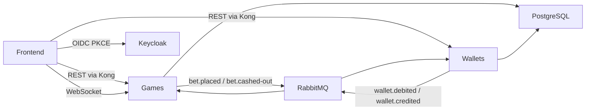

# Crash Game — Entrega Full-stack

Implementação do desafio Jungle Gaming: dois microserviços NestJS (Games + Wallets) comunicando via RabbitMQ, frontend React em tempo real e infraestrutura Docker Compose.

> Especificação original do desafio: [CHALLENGE.md](./CHALLENGE.md)

---

## Visão geral

O projeto é um **Crash Game** multiplayer: jogadores apostam antes da rodada, acompanham o multiplicador subindo em tempo real e sacam (cash out) antes do crash para garantir o ganho.

**O que foi entregue:**

- **Games Service** — ciclo de vida da rodada, apostas, cashout, provably fair, WebSocket (push)
- **Wallets Service** — saldo do jogador, débito/crédito assíncrono via RabbitMQ
- **Frontend** — Vite + React 19, gráfico animado, apostas ao vivo, histórico, verificação provably fair
- **5 pacotes compartilhados** — `@crash/auth`, `@crash/messaging`, `@crash/money`, `@crash/provably-fair`, `@crash/websocket`

### URLs locais (após `npm run docker:up`)

| Serviço | URL |
|---------|-----|
| Frontend | http://localhost:3000 |
| API Gateway (Kong) | http://localhost:8000 |
| Games REST (via Kong) | http://localhost:8000/games |
| Wallets REST (via Kong) | http://localhost:8000/wallets |
| Games Swagger | http://localhost:4001/docs ou http://localhost:8000/games/docs |
| Wallets Swagger | http://localhost:4002/docs ou http://localhost:8000/wallets/docs |
| Games WebSocket | http://localhost:4001 (direto, não roteado pelo Kong) |
| Keycloak | http://localhost:8080 |
| RabbitMQ Management | http://localhost:15672 (`admin` / `admin`) |

### Fluxo de comunicação



---

## Pré-requisitos

- Docker e Docker Compose
- Node.js (apenas para `npm run docker:up` / `env:ensure` no host)
- Portas livres: `3000`, `4001`, `4002`, `5432`, `5672`, `8000`, `8080`, `15672`

---

## Setup rápido

```bash
git clone https://github.com/victorhsalves/crash-game
cd crash-game
npm run docker:up      # env:ensure + docker compose up
```

O comando `docker:up` executa `env:ensure` antes do Compose. Esse script cria `services/games/.env` e `services/wallets/.env` a partir dos respectivos `.env.example` **somente quando ainda não existem**. Customizações em `.env` existentes são preservadas.

**Outros comandos:**

```bash
npm run docker:down    # para os containers
npm run docker:prune   # remove containers, volumes e imagens (reset completo)
```

Após subir, acesse http://localhost:3000, faça login com o usuário de teste e jogue.

---

## Desenvolvimento local

Para iterar com hot reload sem rebuild de imagens Docker:

1. Suba a stack (ou apenas infra: postgres, rabbitmq, keycloak, kong).
2. Garanta os arquivos `.env`:
   ```bash
   bun run env:ensure
   cp frontend/.env.example frontend/.env   # se ainda não existir
   ```
3. Inicie cada serviço em um terminal:
   ```bash
   cd services/games && bun run dev      # porta 4001
   cd services/wallets && bun run dev    # porta 4002
   cd frontend && bun run dev            # porta 5173 (Vite dev server)
   ```

**Nota:** no Docker o frontend roda na porta `3000`; no dev local do Vite, na porta `5173`.

### Variáveis de ambiente relevantes

| Variável | Serviço | Default | Efeito |
|----------|---------|---------|--------|
| `INITIAL_WALLET_BALANCE_CENTS` | wallets | `2000` | Saldo inicial ao criar carteira (R$ 20,00) |
| `ENABLE_INTERNAL_TEST_ROUTES` | wallets | `true` | Habilita `POST /internal/wallet/set-balance` (E2E) |
| `ROUND_BETTING_DURATION_SECONDS` | games | `10` | Duração da fase de apostas |
| `ROUND_CRASHED_DURATION_SECONDS` | games | `10` | Pausa após o crash |
| `CURVE_GROWTH_FACTOR` | games | `0.23` | Velocidade da curva exponencial |
| `CLIENT_SEED` | games | `crash-challenge-v1` | Client seed do provably fair |
| `HASH_CHAIN_LENGTH` | games | `10000` | Tamanho da hash chain de seeds |
| `MAX_CRASH_POINT` | games | `1000` | Crash point máximo |
| `VITE_API_BASE_URL` | frontend | `http://localhost:8000` | Base REST via Kong |
| `VITE_WS_URL` | frontend | `http://localhost:4001` | WebSocket direto no games |

Templates completos: `services/games/.env.example`, `services/wallets/.env.example`, `frontend/.env.example`.

---

## Usuário de teste e saldo

O realm Keycloak `crash-game` é importado automaticamente no `docker:up`.

| Campo | Valor |
|-------|-------|
| Username | `player` |
| Password | `player123` |
| Realm | `crash-game` |
| Client ID | `crash-game-client` |
| Keycloak Admin | `admin` / `admin` |

### Saldo inicial

Ao criar a carteira (automático no primeiro login ou via `POST /wallets`), o jogador recebe **R$ 20,00** (`INITIAL_WALLET_BALANCE_CENTS=2000`). A operação gera uma transação auditável com `referenceId: "initial-balance"`.

**Reset de estado:** se a carteira do `player` já existir de uma sessão anterior, o saldo não é resetado. Use `npm run docker:prune` seguido de `npm run docker:up` para um ambiente limpo.

### Fluxo do jogador

1. Acesse http://localhost:3000
2. Login via OIDC PKCE (redirect para Keycloak)
3. Carteira criada automaticamente com saldo inicial
4. Aposte na fase de apostas, acompanhe o multiplicador e faça cash out durante a rodada

---

## Testes

| Escopo | Comando | Pré-requisito |
|--------|---------|---------------|
| Unit — games | `cd services/games && bun test tests/unit` | — |
| Unit — wallets | `cd services/wallets && bun test tests/unit` | — |
| Unit — provably-fair | `cd packages/provably-fair && bun test tests` | — |
| Unit — frontend | `cd frontend && bun test` | — |
| E2E — games | `cd services/games && bun run test:e2e` | `bun run docker:up` |

Os testes E2E validam health dos serviços via Kong (`tests/e2e/setup.ts`) e ajustam saldo via rota interna `POST /internal/wallet/set-balance` (habilitada por `ENABLE_INTERNAL_TEST_ROUTES`).

**Specs E2E:**

- `bet-cashout-balance.e2e.spec.ts` — apostar, cashout REST, crédito na wallet após crash
- `bet-cashout-errors.e2e.spec.ts` — erros de cashout (sem aposta, rodada encerrada, etc.)
- `bet-crash-lost.e2e.spec.ts` — aposta perdida no crash
- `validation-errors.e2e.spec.ts` — saldo insuficiente, aposta dupla, aposta fora da fase de apostas

---

## Estrutura do monorepo

```
fullstack-challenge/
├── services/
│   ├── games/              # Engine do jogo, rodadas, apostas, WebSocket
│   └── wallets/            # Carteira, débito/crédito assíncrono
├── packages/
│   ├── auth/               # JWT Keycloak (REST + WebSocket guards)
│   ├── messaging/          # RabbitMQ publisher/subscriber + contratos de eventos
│   ├── money/              # Value object Money (centavos bigint)
│   ├── provably-fair/      # Hash chain + HMAC crash point (compartilhado FE/BE)
│   └── websocket/          # Abstrações Socket.IO para NestJS
├── frontend/               # Vite + React 19 + TanStack + Zustand + Tailwind v4
├── scripts/
│   └── ensure-env.ts       # Cria .env a partir de .env.example
├── docker/
│   ├── kong/kong.yml
│   ├── keycloak/realm-export.json
│   └── postgres/init-databases.sh
├── docker-compose.yml
├── CHALLENGE.md            # Especificação original do desafio
└── README.md               # Este documento
```

Cada serviço segue camadas DDD: `domain/` → `application/` → `infrastructure/` → `presentation/`.

---

## Decisões de arquitetura

### DDD e bounded contexts

**Games** — agregado `GameRound` com ciclo `WAITING → BETTING → RUNNING → CRASHED → FINISHED`; entidade rica `Bet` com máquina de estados (`PENDING → ACCEPTED → CASHED_OUT | LOST | REJECTED`); value objects `Multiplier` e `CrashPoint`.

**Wallets** — agregado `Wallet` com invariantes de saldo; dinheiro representado por `@crash/money` (centavos `bigint`, sem ponto flutuante).

Domain events existem in-process (`AggregateRoot.addEvent`), mas a integração entre serviços usa **eventos explícitos** publicados nos use cases, não um dispatcher automático de domain events.

### RabbitMQ — saga de aposta

Exchange `crash.events` (topic). Routing keys em `packages/messaging/src/contracts/routing-keys.ts`:

| Routing key | Fluxo |
|-------------|-------|
| `bet.placed` | Games publica após `POST /bet` → Wallets debita |
| `wallet.debited` | Wallets confirma débito → Games aceita aposta |
| `wallet.debit-failed` | Wallets falha no débito → Games rejeita aposta (compensação) |
| `bet.cashed-out` | Games publica após crash + settle → Wallets credita payout |
| `wallet.credited` | Wallets confirma crédito → Games notifica cliente via WS |

**Aposta:**

```
POST /bet → bet.placed → Wallet debita → wallet.debited | wallet.debit-failed → Games aceita/rejeita + WS
```

**Liquidação (cashout):**

```
POST /bet/cashout → bet CASHED_OUT (Games) → [crash] → settle-round-bets → bet.cashed-out → Wallet credita → wallet.credited → WS bet.updated
```

Idempotência garantida por `referenceId` nas transações (ex.: `${betId}:credit`).

### Sincronização do multiplicador

**Decisão:** interpolação client-side — o servidor não envia ticks do multiplicador.

1. Servidor emite eventos de fronteira via WebSocket:
   - `round.betting-opened` — início da fase de apostas (inclui `serverSeedHash`)
   - `round.running` — início da rodada (`startedAt`, `serverTime`, `growthFactor`)
   - `round.crashed` — crash (`crashPoint`, `serverSeed` revelado)
   - `round.finished` — fim da rodada
2. Cliente calcula localmente: `multiplier = exp(growthFactor × elapsedSeconds)` em `requestAnimationFrame`
3. Correção de clock skew: `serverOffsetMs = serverTime - Date.now()`
4. Reconnect: backfill via `GET /rounds/current`
5. Cashout server-side usa a mesma curva, com `min(multiplicadorCalculado, crashPoint)`

**Por quê:** baixo consumo de banda, sincronização determinística entre abas, servidor autoritativo no instante do cashout.

### Provably fair

- **Hash chain** de 10.000 seeds SHA-256 gerada no bootstrap (`hash-chain-seed-provider.ts`)
- Durante apostas: expõe `serverSeedHash`; após crash: revela `serverSeed`
- **Crash point:** `HMAC-SHA256(serverSeed, "${clientSeed}:${nonce}")` com fórmula padrão (`packages/provably-fair`)
- **Verificação:** `GET /rounds/:roundId/verify` + modal no frontend
- Pacote `@crash/provably-fair` compartilhado entre backend e frontend garante o mesmo algoritmo

### Frontend

- **Stack:** Vite, React 19, TanStack Router/Query, Zustand, Tailwind CSS v4
- **Auth:** OIDC authorization code + PKCE (não password grant)
- **UI:** gráfico SVG animado, lista de apostas ao vivo, histórico de rodadas e apostas, modal provably fair
- **UX:** dark mode, layout responsivo, skeletons, toasts de erro, payout potencial no botão Cash Out, animações de crash/cashout

### Documentação API (Swagger)

Ambos os serviços expõem OpenAPI em `/docs` via `@nestjs/swagger`. O Swagger do Games inclui tabela de eventos WebSocket na descrição. Autenticação REST: JWT Keycloak via botão **Authorize** (usuário `player` / `player123`).

---

## Trade-offs conscientes

| Decisão | Implementação atual | Alternativa | Justificativa |
|---------|---------------------|-------------|---------------|
| **Cashout** | REST `POST /bet/cashout` | WebSocket inbound | Alinhado à spec; HTTP com semântica clara; WS mantido só para push (`bet.updated`) |
| **Liquidação wallet** | Crédito após crash (batch) | Crédito imediato no cashout | Consistência entre serviços; cashout grava multiplier, wallet credita no settle |
| **Multiplicador** | Interpolação client-side | Server tick broadcast | Banda baixa; mesma fórmula garante sync entre clientes |
| **Crédito/débito wallet** | Apenas RabbitMQ (prod) | REST público | Spec respeitada; `/credit` e `/debit` removidos da API pública |
| **Rotas internas E2E** | `POST /internal/wallet/set-balance` com flag env | Expor credit REST | Isolado de produção; habilitado só com `ENABLE_INTERNAL_TEST_ROUTES=true` |
| **Outbox/Inbox** | Não implementado | Garantia at-least-once | Menor complexidade; idempotência por `referenceId` |
| **Saldo inicial** | R$ 20 via env na criação | Seed SQL / crédito manual | Configurável; jogador pode jogar imediatamente após login |

### Evolução: cashout WebSocket → REST

A versão inicial usava `bet.cashout` via WebSocket (ação inbound no gateway). Foi migrado para `POST /games/bet/cashout` em alinhamento com a especificação do desafio. O gateway WebSocket hoje apenas autentica conexões (JWT no handshake); não há `@SubscribeMessage` para ações do jogador. Notificações de resultado continuam via WS (`bet.updated`, eventos de rodada).

---

## API implementada

Todos os endpoints REST são acessados via Kong (`http://localhost:8000`). Documentação interativa: Swagger (URLs na tabela acima).

### REST — Wallets (`/wallets`)

| Método | Endpoint | Auth | Descrição |
|--------|----------|------|-----------|
| `GET` | `/wallets/health` | Não | Health check |
| `POST` | `/wallets` | Sim | Cria carteira (com saldo inicial configurável) |
| `GET` | `/wallets/me` | Sim | Retorna carteira e saldo |

Crédito e débito **não** são expostos via REST público — ocorrem via RabbitMQ.

### REST — Games (`/games`)

| Método | Endpoint | Auth | Descrição |
|--------|----------|------|-----------|
| `GET` | `/games/health` | Não | Health check |
| `GET` | `/games/rounds/current` | Não | Estado da rodada atual com apostas |
| `GET` | `/games/rounds/history` | Não | Histórico paginado de rodadas |
| `GET` | `/games/rounds/:roundId/verify` | Não | Dados de verificação provably fair |
| `GET` | `/games/bets/me` | Sim | Histórico de apostas do jogador |
| `GET` | `/games/bets/:id` | Sim | Aposta por ID |
| `POST` | `/games/bet` | Sim | Fazer aposta na rodada atual |
| `POST` | `/games/bet/cashout` | Sim | Sacar no multiplicador atual |

### WebSocket — Games (server → client)

Conexão Socket.IO em `http://localhost:4001`. Autenticação: JWT no handshake (`auth.token`).

| Evento | Descrição |
|--------|-----------|
| `round.betting-opened` | Nova fase de apostas |
| `round.running` | Rodada iniciada (parâmetros da curva) |
| `round.crashed` | Crash (revela seed e crash point) |
| `round.finished` | Rodada encerrada |
| `round.bet-added` | Nova aposta na rodada |
| `round.bet-updated` | Aposta atualizada (cashout, etc.) |
| `bet.accepted` | Aposta aceita pelo serviço |
| `bet.rejected` | Aposta rejeitada (ex.: saldo insuficiente) |
| `bet.updated` | Atualização de aposta (cashout, wallet credited) |

Ações do jogador (apostar, sacar) são feitas via **REST**. WebSocket é exclusivamente push do servidor.

---

## O que não foi implementado

- CI/GitHub Actions
- Outbox/Inbox transacional
- Auto cashout / auto bet
- Rate limiting
- Playwright (E2E de browser)
- Seed determinístico para testes E2E (item bônus do desafio)

---

## Checklist de entrega

**Infra e setup**

- [ ] `npm run docker:up` sobe tudo sem passos manuais (fresh clone)
- [ ] Frontend em http://localhost:3000, login Keycloak funciona
- [ ] Gameplay: apostar → multiplicador → cashout REST → saldo atualizado após crash

**Documentação**

- [ ] README de entrega no topo do repositório
- [ ] CHALLENGE.md preserva spec original
- [ ] Trade-offs e decisões de arquitetura documentados

**Requisitos eliminatórios**

- [ ] Dois serviços separados + RabbitMQ
- [ ] Sincronização em tempo real (múltiplas abas)
- [ ] Dinheiro em centavos inteiros, saldo nunca negativo
- [ ] Autenticação JWT via Keycloak
- [ ] Testes unitários + E2E passando
- [ ] Usuário `player` com saldo disponível após primeiro login
